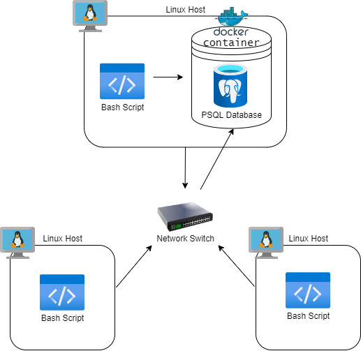

# Linux Cluster Monitoring Agent

# Introduction
The Linux Cluster Monitoring Agent (LCMA) is used to record hardware specifications and monitor resource usage (e.g. CPU/Memory) in real-time. It is used by the Jarvis Linux Cluster Administration for a Linux cluster of nodes/servers running CentOS 7.

Crontab triggers are used to collect data from the host machine every minute, which is then stored in a Relational Database Management System database using PostgreSQL (PSQL).

Bash scripts are used to create, stop, and start the PSQL Docker instance for data collection.

SQL queries are used to analyze and present the collected data. They can find the average memory a node uses over a time interval and detect server failures.

Version control was done through Git, and the remote repository is hosted and managed on GitHub.

Technology used:
- Google Cloud Platform
- CentOS 7
- Bash
- PSQL
- Docker
- Git

# Quick Start
- Start a psql instance using ```psql_docker.sh```
```bash
# create a psql docker container with a given username and password.
./scripts/psql_docker.sh create db_username db_password
```
- Create tables using ```ddl.sql```
```bash
# Execute ddl.sql script on the host_agent database againse the psql instance
psql -h localhost -U postgres -d host_agent -f sql/ddl.sql
```
- Insert hardware specs data into the DB using ```host_info.sh```
```bash
# Script usage
./scripts/host_info.sh psql_host psql_port db_name psql_user psql_password
```
- Insert hardware usage data into the DB using ```host_usage.sh```
```bash
# Script usage
./scripts/host_usage.sh psql_host psql_port db_name psql_user psql_password
```
- Crontab setup
```bash
#edit crontab jobs
bash> crontab -e

#add to crontab
* * * * * bash /home/centos/dev/jrvs/bootcamp/linux_sql/host_agent/scripts/host_usage.sh localhost 5432 host_agent postgres password > /tmp/host_usage.log
```

# Implemenation
This project is implemented with three bash scripts and two SQL files:
- ```psql_docker.sh``` provisions and runs a PSQL database instance using Docker
- ```ddl.sql``` creates the ```host_info``` and ```host_usage``` tables, which hold hardware specification data and server usage data, respectively
- ```host_info.sh``` and ```host_usage.sh``` collects the appropriate data for their respective tables
- ```queries.sql``` analyzes and present the data in the database, which is useful for business problems such as finding average memory usage and detecting host failures

## Architecture
Cluster diagram with three Linux hosts, a DB, and agents:



The host that provisions and manages the database does so using ```psql_docker.sh``` and ```ddl.sql```, respectively. Each hosts' bash scripts send its ```host_usage``` data to the PSQL database.

## Scripts
- ```psql_docker.sh``` is used to create, start, or stop a PSQL container
```bash
# create a psql docker container with a given username and password.
./scripts/psql_docker.sh create db_username db_password
./scripts/psql_docker.sh start
./scripts/psql_docker.sh stop
```
- ```host_info.sh``` collects hardware specification data; hardware specifications are assumed to be static, so this script will be executed only once at installation time
```bash
# create a psql docker container with a given username and password.
./scripts/host_info.sh psql_host psql_port db_name psql_user psql_password
```
- ```host_usage.sh``` collects server usage data
```bash
# create a psql docker container with a given username and password.
./scripts/host_usage.sh psql_host psql_port db_name psql_user psql_password
```
- crontab is used to execute ```host_usage.sh``` every minute
```bash
# create a psql docker container with a given username and password.
./scripts/psql_docker.sh create db_username db_password
```
- ```queries.sql``` is used to solve some business objectives:
  - analyzing and presenting the data in the database in a neat and organized way, by grouping hosts together and then sorting them based on their their memory size
  - calculating the average memory used over a 5 minute-interval
  - detecting host failures by checking if the cron job inserts at least three data points every 5 minutes

## Database Modeling
Schema of each table using markdown table syntax:
### - `host_info`
Field | Data Type | Constraint | Description 
:---: | :---: | :---: | :---:
id | `SERIAL` | `PRIMARY KEY` | Unique identifier for each node, auto increments with new entries
hostname | `VARCHAR` | `UNIQUE` | Name of the host machine 
cpu_number | `INT` | `NOT NULL` | Number of CPU cores
cpu_architecture | `VARCHAR` | `NOT NULL` | CPU architecture
cpu_model | `VARCHAR` | `NOT NULL` | CPU model
cpu_mhz | `NUMERIC` | `NOT NULL` | CPU processor speed, in MHz
L2_cache | `INT` | `NOT NULL` | Size of the level 2 cache, in kB
total_mem | `INT` | `NOT NULL` | Total memory of host machine, in kB
timestamp | `TIMESTAMP` | `NOT NULL` | Time of host_info script execution
#### sample record:
id | hostname | cpu_number | cpu_architecture | cpu_model | cpu_mhz | L2_cache | total_mem | timestamp
:---: | :---: | :---: | :---: | :---: | :---: | :---: | :---: | :---:
1 | jrvs-remote-desktop-centos7.us-east1-c.c.driven-actor-329519.internal | 2 | x86_64 | Intel(R) Xeon(R) CPU @ 2.20GHz | 2199.998 | 256 | 8005740 | 2021-10-28 16:47:13

### - `host_usage`
Field | Data Type | Constraint | Description 
:---: | :---: | :---: | :---:
timestamp | `TIMESTAMP` | `PRIMARY KEY` | Time of host_usage script execution
host_id | `INT` | `REFERENCES host_info(id)` | The ID of the host found in host_info table
memory_free | `INT` | `NOT NULL` | Amount of free memory, in MB
cpu_idle | `INT` | `NOT NULL` | % of CPU not in use
cpu_kernel | ` INT ` | `NOT NULL` | % of CPU used by the kernel
disk_io | `INT` | `NOT NULL` | Number of disk I/O
disk_available | `INT` | `NOT NULL` | Available disk space in the root directory, in MB
#### sample record:
timestamp | host_id | memory_free | cpu_idle | cpu_kernel | disk_io | disk_available
:---: | :---: | :---: | :---: | :---: | :---: | :---:
| 2021-10-28 16:47:13 | 1 | 6874372 | 100 | 0 | 0 | 24267

# Test
- ```psql_docker.sh``` was tested by verifying whether or not the PSQL Docker instance was successfully created, started, or stopped
- ```ddl.sql``` was tested by verifying whether or not the ```host_info``` and ```host_usage``` tables were created successfully and correctly
- ```host_info.sh``` and ```host_usage.sh``` were tested by verifying whether or not each script's respective data was inserted into the database
- ```queries.sql``` was tested by manually adding mock data entries and then comparing the filtered results with the expected results

# Deployment
- Implemented on a CentOS 7 virtual machine hosted on Google Cloud Platform
- PSQL database instance was provisioned with Docker
- Crontab was used to automate new server usage data entries periodically
- Git was used for local version control
- GitHub was used for remote repository hosting and management

# Improvements
- In this project, hardware specifications are assumed to be static; alter the project so that it can also handle hardware updates
- Add an intuitive, user-friendly interface to more easily manage the data in the database
- Create additional queries that also provide useful information, such as average CPU usage and average disk usage
